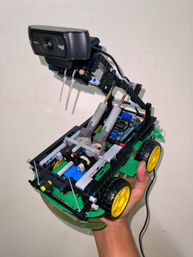
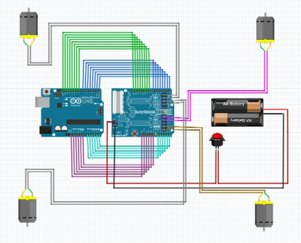
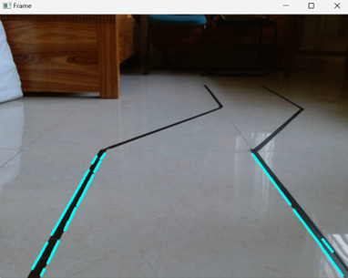
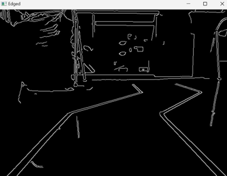
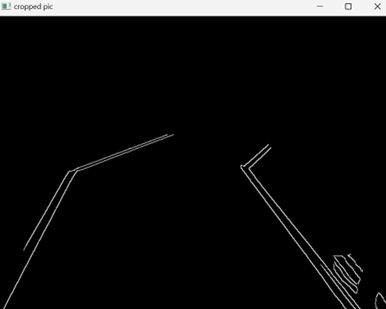
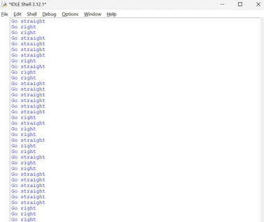
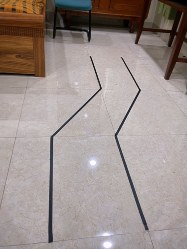
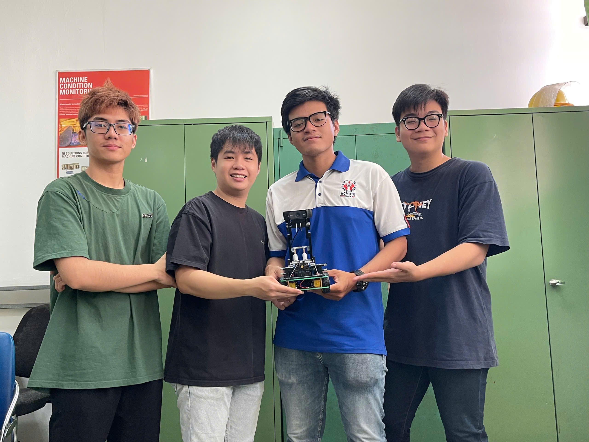

# Vision-Based Lane-Following Vehicle

   
  <em>Figure 1. Completed lane-following vehicle assembled for laboratory-scale testing and physical track experiments.</em>

A small-scale lane-following vehicle that uses computer vision to detect lane markings, determine the required steering direction, and control four DC motors through an Arduino-based system.

## Overview

This project presents a small-scale lane-following vehicle developed as an undergraduate engineering project. A webcam mounted on the vehicle captures the road ahead, while Python and OpenCV process the camera images to detect lane markings.

The vision pipeline includes grayscale conversion, Gaussian blur, Canny edge detection, a region of interest, and probabilistic Hough line detection. Detected line orientations are then used to determine whether the vehicle should move straight, turn left, or turn right.

The resulting control commands are transmitted from Python to an Arduino UNO through serial communication. The Arduino controls four DC motors through an L293D motor shield to produce the corresponding vehicle movement.

The system was built and tested on a laboratory-scale track using adhesive tape as the lane markings.

## Project Objectives

- Develop a small-scale vehicle capable of following a marked lane.
- Process camera images using Python and OpenCV for lane detection.
- Extract and filter relevant road-line features from the camera image.
- Determine steering direction from the detected line orientations.
- Establish serial communication between Python and Arduino.
- Control four DC motors through an Arduino UNO and L293D motor shield.
- Build and test the complete system on a physical track.

## System Architecture

## Hardware

| Component | Purpose |
|---|---|
| Arduino UNO | Receives control commands and controls the vehicle motors |
| L293D Motor Shield | Drives the four DC motors |
| 4 DC Motors | Provides vehicle propulsion and differential turning |
| Logitech C920e Webcam | Captures the road and lane markings |
| Acrylic Chassis | Provides the main vehicle structure |
| Lego Technic Camera Frame | Supports and positions the webcam |
| Lithium Battery Pack | Supplies power to the vehicle |

### Wiring Diagram

   
  <em>Figure 2. Wiring diagram showing connections among the Arduino, motor shield, motors, and power supply.</em>

The wiring connects the Arduino UNO and L293D motor shield to the four DC motors and the vehicle power system. The webcam is connected to the computer running the Python-based vision and control program.

## Software

### Python

The Python program is responsible for camera acquisition, image processing, lane detection, steering decisions, and serial communication with the Arduino.

Main libraries and functions include:

- **OpenCV** for image acquisition and computer vision processing
- **NumPy** for image and array operations
- **Math** for line-angle calculations
- **Serial communication** for transmitting steering commands to the Arduino
- **Time** for timing-related operations

### Arduino

The Arduino program uses the **AFMotor** library to control the four DC motors through the L293D motor shield.

The Arduino communicates with the Python program through serial communication at a baud rate of **115200**.

## How It Works

The vehicle follows a marked lane through a vision-based control pipeline. The camera image is processed in Python to extract relevant lane lines, and the detected line orientations are used to determine the vehicle movement command.

### 1. Camera Capture

A Logitech C920e webcam captures the road in front of the vehicle. The captured frame is resized to 640 × 480 pixels before further processing.

To reduce the processing load, the program processes every third captured frame.

   
  <em>Figure 3. Raw camera image captured from the vehicle before image processing and lane detection.</em>

### 2. Image Preprocessing

Each selected frame is converted from BGR to grayscale and then smoothed using a 5 × 5 Gaussian blur. Canny edge detection is subsequently applied to identify prominent edges in the image.

The current implementation uses Canny thresholds of 90 and 150.

### 3. Region of Interest

A region of interest is applied to focus the edge detection on the road area in front of the vehicle. This reduces the influence of image regions outside the area relevant to lane detection.

### 4. Lane Line Detection

The processed region is analyzed using the probabilistic Hough Line Transform to identify line segments. These detected line segments represent candidate lane markings in the camera image.

   
  <em>Figure 4. Detected line segments extracted from the processed camera image for lane-following.</em>

### 5. Line Filtering

Detected line segments are evaluated based on their orientation. Lines with an absolute angle below 45 degrees are excluded to remove approximately horizontal features that are less relevant to the lane-following task.

The remaining line orientations are accumulated into a directional value, represented by `theta`.

   
  <em>Figure 5. Filtered line segments after removing approximately horizontal features from the detected image.</em>

### 6. Steering Decision

The accumulated line orientation is compared with a threshold value of 5 degrees:

| Condition | Vehicle command |
|---|---|
| `theta > 5` | Turn left |
| `theta < -5` | Turn right |
| Otherwise | Move straight |

The corresponding command is transmitted to the Arduino through serial communication. To reduce the command frequency, the program sends a control command every third steering decision.

### 7. Arduino Motor Control

The Arduino receives the commands through serial communication at 115200 baud and controls the four DC motors through the L293D motor shield.

The Python program uses three commands:

| Command | Meaning |
|---|---|
| `L` | Turn left |
| `R` | Turn right |
| `S` | Move straight |

For turning, the Arduino selectively releases a pair of motors, allowing the vehicle to change direction. When a straight-motion command is received, all four motors are driven in the configured direction.

### 8. Control Output

The Python program continuously displays the processed camera views and prints the current movement decision in the console. During operation, the output includes commands such as `Go straight`, `Go left`, and `Go right`.

   
  <em>Figure 6. Python console output showing directional decisions during real-time vehicle operation.</em>

## Experimental Setup

The completed vehicle was tested on a laboratory-scale track constructed using adhesive tape to represent the lane markings.

The test setup consisted of the vehicle-mounted webcam, the Python-based vision and control program running on a computer, and the Arduino-based motor-control system. The camera was positioned to provide a forward view of the marked track while the vehicle operated along the designated path.

   
  <em>Figure 7. Laboratory-scale test track constructed with adhesive tape for lane-following experiments.</em>

The testing process focused on verifying the complete control pipeline, from camera-based lane detection and steering decisions to serial communication and physical vehicle movement.

## Results

The completed system successfully demonstrated the intended lane-following function on the marked test track.

The main observed outcomes were:

| Test Aspect | Observed Result |
|---|---|
| Lane detection | The system detected the main lane markings from camera images. |
| Line filtering | Irrelevant line features were reduced before the steering decision. |
| Steering decision | The system generated left, right, and straight movement commands. |
| Python-Arduino communication | Steering commands were transmitted through serial communication. |
| Vehicle movement | The vehicle followed the marked path during physical testing. |

The experiments demonstrated the integration of computer vision, serial communication, embedded motor control, and a physical vehicle platform in a single working system.

## Project Gallery

   
  <em>Figure 8. Group 4 members during the development of the vision-based lane-following vehicle.</em>

   
  <em>Figure 9. Close-up view of the completed vehicle chassis, motors, and camera assembly.</em>

