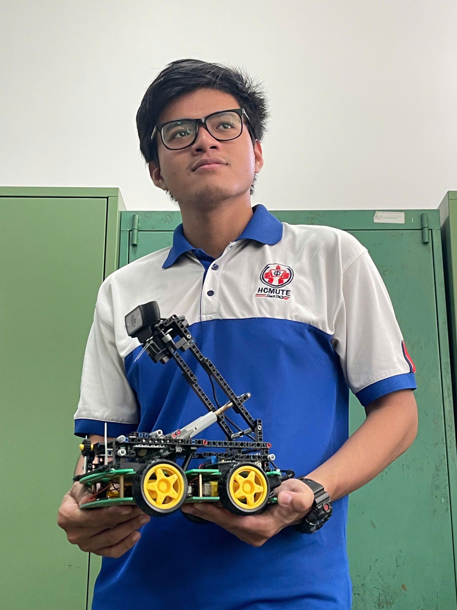

# Vision-Based Lane-Following Vehicle

  

A small-scale lane-following vehicle that uses computer vision to detect lane markings, determine the required steering direction, and control four DC motors through an Arduino-based system.

## Overview

This project presents a small-scale lane-following vehicle developed as an undergraduate engineering project. A webcam mounted on the vehicle captures the road ahead, while Python and OpenCV process the camera images to detect lane markings.

The vision pipeline includes grayscale conversion, Gaussian blur, Canny edge detection, a region of interest, and probabilistic Hough line detection. Detected line orientations are then used to determine whether the vehicle should move straight, turn left, or turn right.

The resulting control commands are transmitted from Python to an Arduino UNO through serial communication. The Arduino controls four DC motors through an L293D motor shield to produce the corresponding vehicle movement.

The system was built and tested on a laboratory-scale track using adhesive tape as the lane markings.

## Project Objectives

- Develop a small-scale vehicle capable of following a marked lane.
- Process camera images using Python and OpenCV for lane detection.
- Extract and filter relevant road-line features from the camera image.
- Determine steering direction from the detected line orientations.
- Establish serial communication between Python and Arduino.
- Control four DC motors through an Arduino UNO and L293D motor shield.
- Build and test the complete system on a physical track.

## System Architecture

